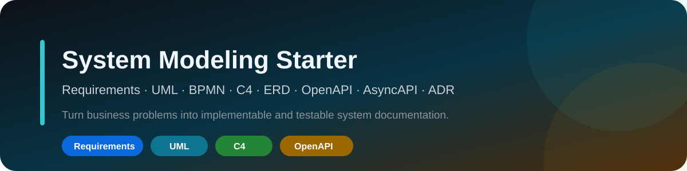

<p align="center"></p>

# System Modeling Starter

**Starter + sistema executável para transformar problema de negócio em documentação implementável, testável e rastreável.**

| Status | Projeto executável | Qualidade |
|---|---|---|
| `v0.2` | **Booking Reference System** | GitHub Actions · pytest · docs quality · secret scan |

`requirements` · `UML` · `BPMN` · `C4` · `ERD` · `OpenAPI` · `AsyncAPI` · `ADR` · `traceability`

## Clone & Run no VS Code

O `Booking Reference System` conecta requisito → regra de negócio → API → teste:

```bash
git clone https://github.com/Videirafo/System-Modeling-Starter.git
cd System-Modeling-Starter/examples/booking-reference-system
code .
```

Depois de criar o ambiente virtual e instalar `.[dev]`:

- **Run and Debug → `Booking: debug FastAPI`**;
- **Tasks → `Booking: dev server`**;
- **Tasks → `Booking: pytest`**.

**[Abrir o Booking Reference System →](./examples/booking-reference-system/README.md)**

### Evidência rastreável

```text
FR / BR / UC
→ app/domain.py
→ app/main.py
→ tests/test_bookings.py
→ docs/traceability.md
```

O exemplo implementa:

- `FR-001` criação de agendamento;
- `FR-002` consulta por identificador;
- `BR-001` intervalo final posterior ao inicial;
- `BR-002` bloqueio de sobreposição para profissional no mesmo tenant;
- `POST /bookings`, `GET /bookings/{id}` e `/health`;
- testes para happy path, conflito, intervalo inválido e escopo por tenant.

## Método

```text
DISCOVER
→ REQUIREMENTS
→ BUSINESS RULES
→ USE CASES
→ PROCESS / ARCHITECTURE
→ DATA
→ API / EVENT CONTRACTS
→ ADR
→ TRACEABILITY
→ IMPLEMENTATION
→ TESTS
→ DOC SYNC
```

## Identificadores

```text
FR-###   Functional Requirement
NFR-###  Non-Functional Requirement
BR-###   Business Rule
UC-###   Use Case
API-###  API Contract
EVT-###  Event Contract
ADR-###  Architecture Decision Record
TEST-### Test / Acceptance Scenario
```

## Qual artefato usar?

| Pergunta | Artefato |
|---|---|
| Quem usa e para quê? | UML Use Case |
| Como o processo atravessa áreas? | BPMN |
| Qual o fluxo de decisão? | UML Activity |
| Quem chama quem e em qual ordem? | UML Sequence |
| Quais estados existem? | UML State Machine |
| Quais conceitos e relações existem? | UML Class / ERD |
| Como o sistema se encaixa no ecossistema? | C4 Context |
| Quais apps/serviços/stores existem? | C4 Container |
| Como a API HTTP é contratada? | OpenAPI |
| Como eventos são contratados? | AsyncAPI |
| Por que a arquitetura escolheu X? | ADR |

## AS-IS antes de TO-BE

```text
EVIDENCE
→ CURRENT IMPLEMENTATION
→ AS-IS MODEL
→ GAPS
→ TO-BE DECISION
→ CHANGE PLAN
```

Em sistema existente, não invente endpoints, entidades ou componentes para preencher diagrama.

## Conteúdo técnico

- [Método](./docs/METHOD.md)
- [Seleção de diagramas](./docs/DIAGRAM_SELECTION.md)
- [Rastreabilidade](./docs/TRACEABILITY.md)
- [Caso de Uso](./templates/USE_CASE_TEMPLATE.md)
- [ADR](./templates/ADR_TEMPLATE.md)
- [Matriz de rastreabilidade](./templates/TRACEABILITY_MATRIX.md)
- [OpenAPI starter](./contracts/openapi.yaml)
- [AsyncAPI starter](./contracts/asyncapi.yaml)
- [Projetos executáveis](./examples/README.md)

## Diagram source + render

Mantenha fonte editável + render quando possível:

```text
diagrams/
├── system-context.dsl
├── system-context.svg
├── booking-sequence.puml
└── booking-sequence.svg
```

PlantUML, Mermaid e Structurizr DSL são opções adequadas conforme o artefato; Astah continua útil quando `.asta` fizer parte da entrega.

## Git workflow

```bash
git checkout -b feat/minha-evolucao
# altere requisitos/código/testes de forma sincronizada
git add .
git commit -m "feat: evolve booking reference system"
git push -u origin feat/minha-evolucao
```

## Segurança

Não publique secrets, `.env` real, IPs internos, topologia sensível, requisitos confidenciais, dados de clientes ou código privado. Consulte [SECURITY.md](./SECURITY.md).

---

Criado por [Fernando Videira](https://github.com/Videirafo) como base pública de modelagem e engenharia de software verificável.
